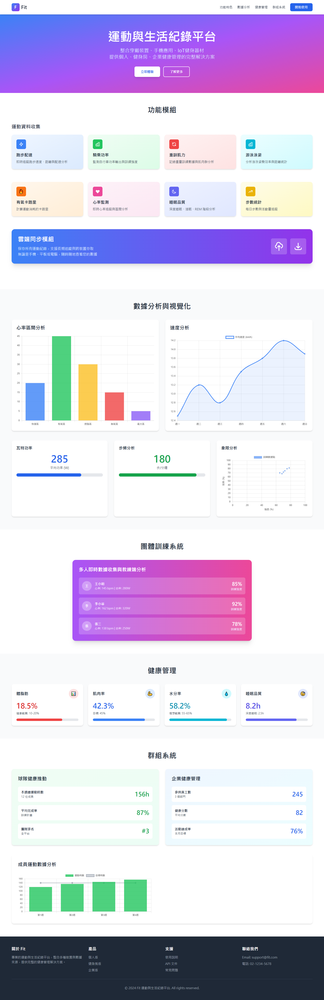

# Fit - 運動與生活紀錄平台 DEMO

使用 Edge Copilot 進行網頁分析，並配合 Cursor AI 復刻一個運動與生活紀錄的平台 DEMO 網站。

---



---

[netlify DEMO 網頁](https://comfy-basbousa-989e68.netlify.app/)
[vercel DEMO 網頁](https://web-fit-psi.vercel.app/)

---

## 📋 專案文件結構

本專案包含以下重要文件，**AI Agent 在執行任務前請務必閱讀相關文件**：

### 🎯 核心文件

1. **`AGENTS.md`** - 專案需求文件
   - 包含完整的專案需求與規格說明
   - **用途**：了解專案的原始需求與目標
   - **何時閱讀**：開始新任務前、需要確認需求時

2. **`PLAN.md`** - 專案規劃文件
   - 包含完整的技術架構、功能設計、API 設計、UI 規劃
   - **用途**：了解專案的完整規劃與技術細節
   - **何時閱讀**：需要了解系統架構、API 設計、功能模組時

3. **`CHANGE.md`** - 變更記錄文件
   - 記錄所有任務執行歷程與變更內容
   - **用途**：了解專案開發歷程、已完成項目、如何接續任務
   - **何時閱讀**：接續任務時、需要了解開發歷史時

4. **`README.md`** - 專案說明文件（本文件）
   - 專案概況與文件指引
   - **用途**：快速了解專案與文件結構

### 📄 實作文件

- **`index.html`** - 主頁面（DEMO 網頁）
  - 完整的響應式網頁實作
  - 包含所有功能模組的展示

---

## 🤖 給 AI Agent 的指引

### 執行任務前的準備

1. **閱讀順序建議**：
   ```
   README.md → AGENTS.md → PLAN.md → CHANGE.md → index.html
   ```

2. **快速了解專案**：
   - 閱讀 `README.md`（本文件）了解專案概況
   - 閱讀 `AGENTS.md` 了解原始需求
   - 閱讀 `CHANGE.md` 了解開發歷程與當前狀態

3. **深入了解技術細節**：
   - 閱讀 `PLAN.md` 了解完整規劃
   - 查看 `index.html` 了解現有實作

### 接續任務流程

1. **確認任務需求**
   - 閱讀用戶需求
   - 參考 `AGENTS.md` 確認是否符合專案目標
   - 查看 `CHANGE.md` 了解已完成項目

2. **規劃實作方案**
   - 參考 `PLAN.md` 中的技術規範與設計
   - 確認實作方向與技術選型
   - 檢查是否需要修改現有檔案

3. **執行實作**
   - 遵循 `PLAN.md` 中的技術規範
   - 保持程式碼風格一致
   - 確保響應式設計

4. **記錄變更**
   - 在 `CHANGE.md` 中記錄任務執行內容
   - 更新相關文件（如需要）

### 重要注意事項

- ✅ **技術棧**：前端使用 HTML5 + Tailwind CSS（CDN），不建議改為其他框架
- ✅ **響應式設計**：所有修改必須保持響應式設計（桌機/平板/手機）
- ✅ **語義化標籤**：使用語義化 HTML 標籤（`<header>`, `<main>`, `<section>`, `<footer>`）
- ✅ **中文支援**：所有文字內容使用繁體中文
- ✅ **檔案命名**：遵循現有的命名規範

---

## 📁 專案檔案清單

```
web_fit/
├── index.html          # 主頁面（DEMO 網頁）
├── AGENTS.md          # 專案需求文件 ⭐
├── PLAN.md            # 專案規劃文件 ⭐
├── CHANGE.md          # 變更記錄文件 ⭐
├── README.md          # 專案說明文件（本文件）⭐
└── LICENSE            # 授權文件
```

**⭐ 標記的文件為 AI Agent 必讀文件**

---

## 🚀 快速開始

### 查看 DEMO

直接在瀏覽器中開啟 `index.html` 即可查看 DEMO 網頁。

### 開發環境

- 無需建置流程，直接使用 CDN
- 使用任何文字編輯器即可開發
- 建議使用現代瀏覽器（Chrome、Firefox、Edge、Safari）

---

## 📝 專案狀態

- ✅ 前端 DEMO 頁面已完成
- ✅ 數據視覺化功能已完成
- ✅ 專案規劃文件已完成
- ⏳ 後端 API 開發（待實作）
- ⏳ 數據庫設計（待實作）

詳細進度請參考 `PLAN.md` 中的「實作進度」章節。

---

**最後更新**：2025  
**維護者**：Fit 開發團隊
